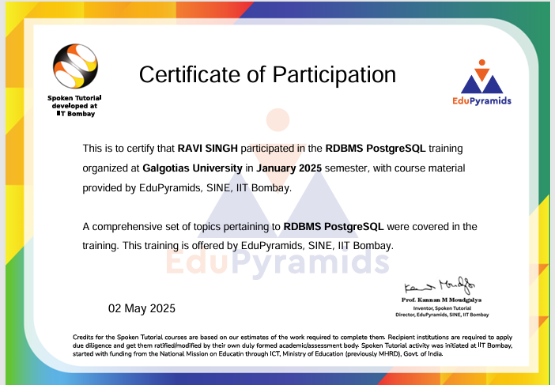
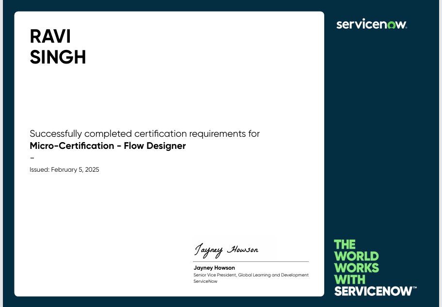
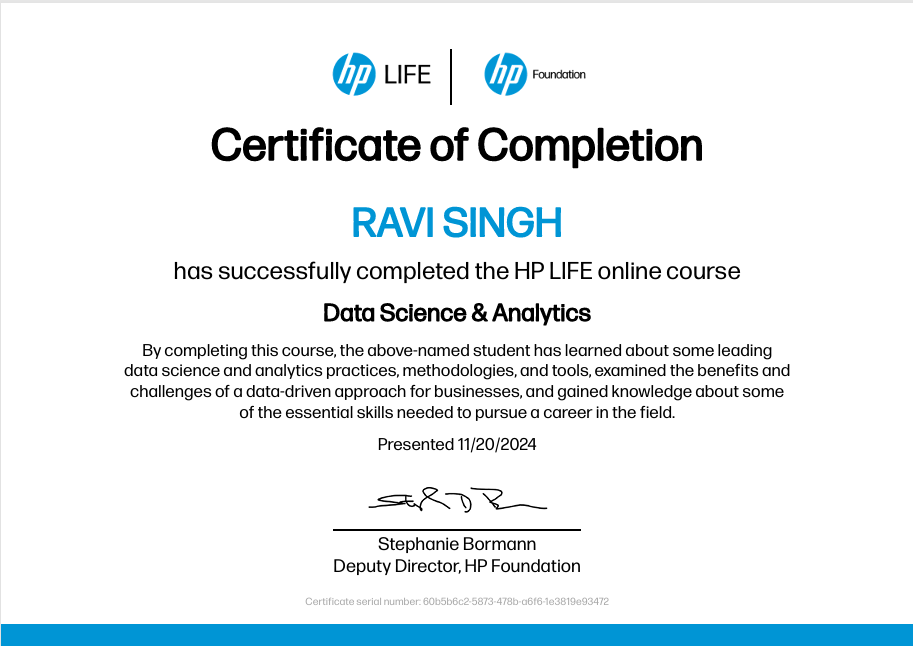
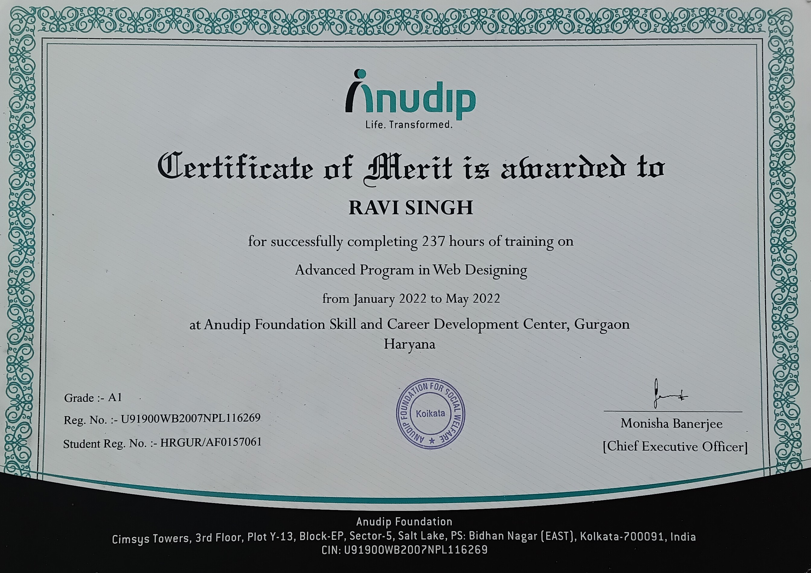
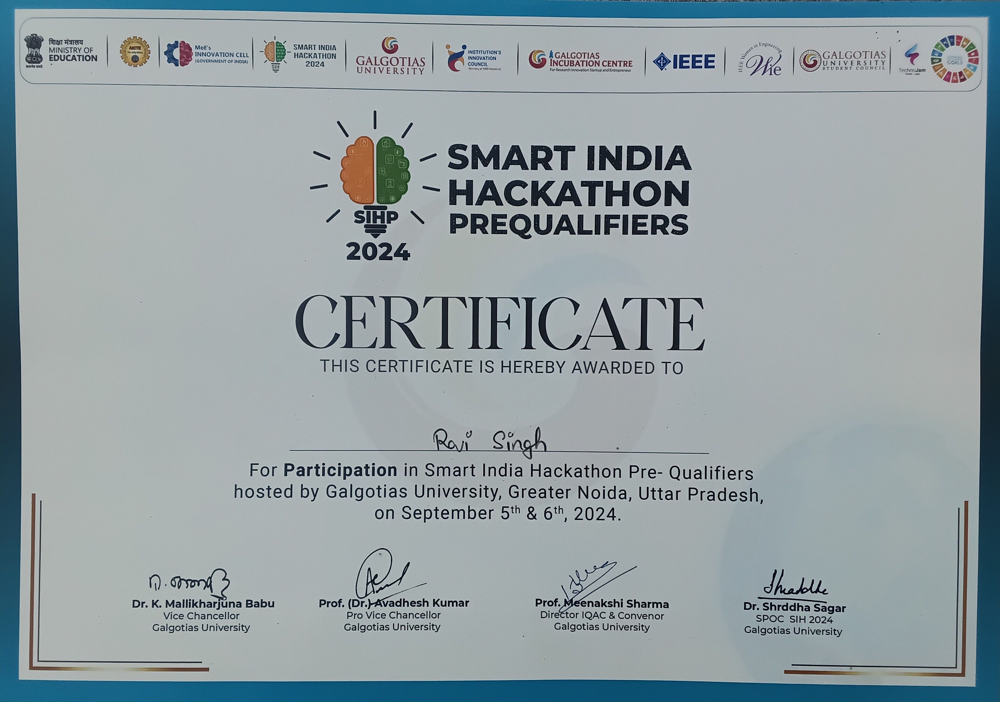
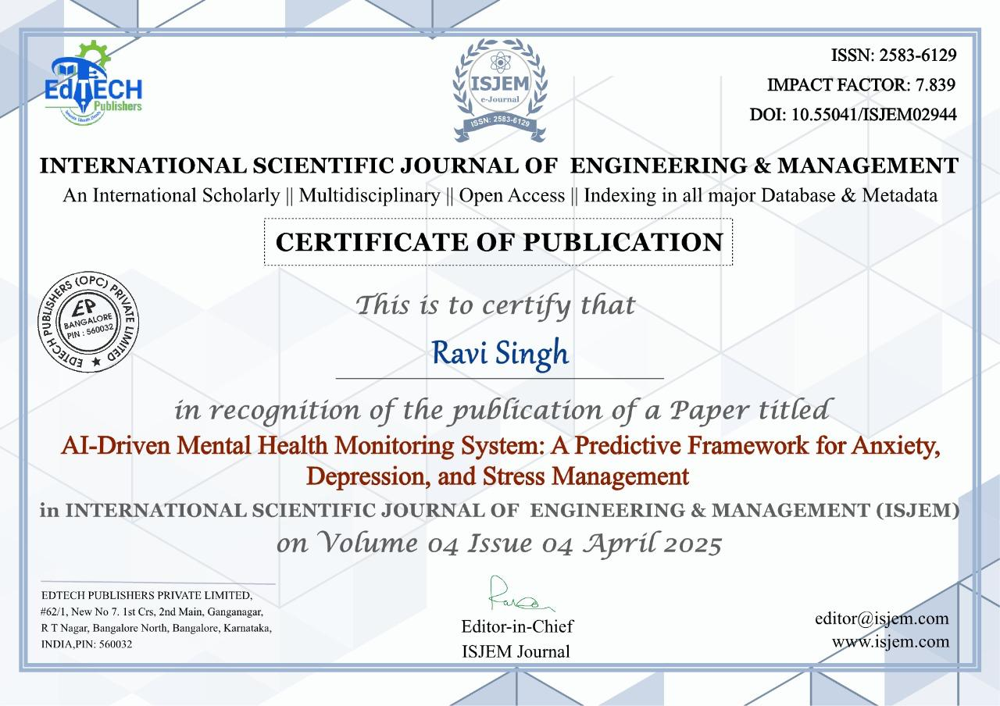

# Ravi Singh
Data Analytics and Data Science · Machine Learning · Open to work

---

## About
I am an adaptive and well‑organized individual with hands‑on experience in data analytics, data science and machine learning. I build data‑driven solutions and deploy models and dashboards that help convert insights into action. Currently open to work and actively seeking roles in data analytics, data science or ML engineering.

Key highlights:
- Practical experience in machine learning model development, NLP, and building interactive dashboards.  
- Strong foundation in data preprocessing, exploratory data analysis, and visualization.

---

## Skills

- Programming: Python, SQL, C++, C  
- Data & ML: NumPy, Pandas, Scikit‑learn, NLP basics, EDA, model evaluation  
- Visualization & Dashboards: Matplotlib, Seaborn, Plotly, Streamlit, Power BI, Excel  
- Databases: MySQL, PostgreSQL (basic)  
- Tools: Jupyter, Colab, VS Code, Git/GitHub  
- Concepts: Machine Learning, Model Deployment, Statistics

---

## Featured Project — AI‑Driven Mental Health Monitoring System
A machine‑learning system that analyzes behavioral and sentiment signals to predict anxiety, depression and stress and presents insights via an interactive dashboard.

Technologies: Python, Pandas, Scikit‑learn, NLP techniques, Streamlit

Highlights:
- Full data pipeline: preprocessing → EDA → feature engineering → classification modeling.  
- Reported model performance: ~91% accuracy for key targets.  
- Interactive Streamlit dashboard for user exploration.

Project: [Project repository](https://github.com/Ravi-Singh64/AI-Driven-Mental-Health-Monitoring-System) · [Live demo](https://ai-driven-mental-health-monitoring-system-aeemfm5u6kr74muypcxl.streamlit.app/)

Project screenshots and model plots (sourced from the project):
- Streamlit dashboard (screenshot)  
  

- Model evaluation and plots  
    
    
    
    
  

---

## Experience

- TechSnitch Pvt. Ltd., Noida — ServiceNow Developer Intern  
  Jan 2025 – Mar 2025  
  Worked on ServiceNow workflows, Flow Designer and scripting for ITSM automation.

- AllDigi Tech Limited, Noida — Customer Care Executive  
  Aug 2022 – Jan 2023  
  Resolved customer queries while strengthening communication, time management and problem solving.

---

## Education

- Master of Computer Applications (MCA), Specialization in Data Analytics — Galgotias University (2025)  
- Bachelor of Computer Applications (BCA) — Maharshi Dayanand University (MDU), Rohtak (2022)  
- Class XII Science — Diwan Chand Arya Senior Secondary School, Lodhi Colony, New Delhi (2019)

---

## Certifications & Publications

- RDBMS PostgreSQL Training — IIT Bombay, EduPyramids, SINE (May 2025)  
- Micro‑Certification — Flow Designer (ServiceNow) (Feb 2025)  
- Data Science & Analytics — HP LIFE (Nov 2024)  
- Advanced Program in Web Designing — Anudip Foundation (June 2022)  
- Smart India Hackathon 2024 — Pre‑Qualifier (Sept 2024)  
- Research Paper: “AI‑Driven Mental Health Monitoring System: A Predictive Framework for Anxiety, Depression, and Stress Management” — ISJEM (Apr 2025)

### Certificates images or pdfs
1) RDBMS PostgreSQL Training — IIT Bombay, EduPyramids, SINE (May 2025)  
     
   [Open PDF](https://raw.githubusercontent.com/Ravi-Singh64/Ravi-Singh64/main/assets/certificates/RAVI-RDBMS-PostgreSQL-Certificate.pdf)

2) Micro‑Certification — Flow Designer (ServiceNow) (Feb 2025)  
     
   [Open PDF](https://raw.githubusercontent.com/Ravi-Singh64/Ravi-Singh64/main/assets/certificates/Ravi_Singh_micro_certfication_Flow_Designer.pdf)

3) Data Science & Analytics — HP LIFE (Nov 2024)  
     
   [Open PDF](https://raw.githubusercontent.com/Ravi-Singh64/Ravi-Singh64/main/assets/certificates/Ravi_Singh_Hp_DataScience_cert.pdf)

4) Advanced Program in Web Designing — Anudip Foundation (June 2022)  
   

5) Smart India Hackathon 2024 — Pre‑Qualifier (Sept 2024)  
   

6) Research publication — ISJEM (Apr 2025)  
   

---

## Resume
Open PDF: [Ravi_Singh_Resume_11.pdf](https://raw.githubusercontent.com/Ravi-Singh64/Ravi-Singh64/main/resume/Ravi_Singh_Resume_11.pdf)

---

## GitHub stats

---

## Contact
- Email: rsj201906@gmail.com  
- GitHub: https://github.com/Ravi-Singh64  
- LinkedIn: https://www.linkedin.com/in/ravi-singh-2ab040240
